# Personal Finance Application

A comprehensive full-stack personal finance management application built with React, Node.js, Express, and Oracle Database. This application helps users track their income, expenses, budgets, savings goals, and generate detailed financial reports.

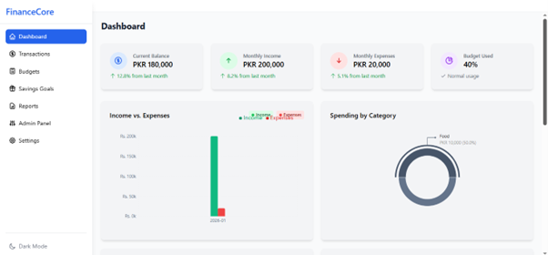

## 📋 Table of Contents

- [Overview](#overview)
- [Features](#features)
- [Technology Stack](#technology-stack)
- [Project Structure](#project-structure)
- [Prerequisites](#prerequisites)
- [Installation & Setup](#installation--setup)
- [Configuration](#configuration)
- [Database Schema](#database-schema)
- [API Documentation](#api-documentation)
- [Frontend Architecture](#frontend-architecture)
- [Backend Architecture](#backend-architecture)
- [Screenshots](#screenshots)
- [Usage Guide](#usage-guide)
- [Security Features](#security-features)
- [License](#license)

## 🎯 Overview

The Personal Finance Application is a robust financial management system designed to help users take control of their finances. It provides an intuitive interface for tracking transactions, managing budgets, setting savings goals, and generating comprehensive financial reports.

### Key Highlights

- **User Authentication & Authorization**: Secure JWT-based authentication with role-based access control (Admin & User roles)
- **Transaction Management**: Track income and expenses with categories
- **Budget Planning**: Set and monitor budgets with real-time tracking
- **Savings Goals**: Create and track progress toward financial goals
- **Financial Reports**: Generate detailed reports with PDF/CSV export capabilities
- **Admin Panel**: Comprehensive user management and audit logging
- **Responsive Design**: Mobile-friendly interface with dark/light theme support

## ✨ Features

### User Features
- ✅ User registration and authentication
- ✅ Dashboard with financial overview and charts
- ✅ Transaction management (Create, Read, Update, Delete)
- ✅ Category-based expense tracking
- ✅ Budget creation and monitoring
- ✅ Savings goals with progress tracking
- ✅ Financial reports (monthly, yearly, custom date range)
- ✅ Report export (PDF and CSV formats)
- ✅ Profile management
- ✅ Dark/Light theme toggle

### Admin Features
- ✅ User management (view, edit, delete users)
- ✅ System audit logs
- ✅ Dashboard analytics
- ✅ Role-based access control

## 🛠️ Technology Stack

### Frontend
- **React 19.1.0** - UI library
- **React Router DOM 7.6.1** - Client-side routing
- **Axios 1.9.0** - HTTP client
- **Recharts 2.15.3** - Data visualization
- **Tailwind CSS 3.4.17** - Utility-first CSS framework
- **Heroicons 2.2.0** - Icon library
- **Vite 6.3.5** - Build tool and dev server
- **date-fns 4.1.0** - Date manipulation library

### Backend
- **Node.js** - Runtime environment
- **Express 4.18.2** - Web application framework
- **Oracle Database (oracledb 5.5.0)** - Database system
- **JWT (jsonwebtoken 9.0.0)** - Authentication
- **bcrypt 5.1.0** - Password hashing
- **Helmet 7.0.0** - Security middleware
- **Morgan 1.10.0** - HTTP request logger
- **Express Validator 7.0.1** - Input validation
- **Multer 1.4.5** - File upload handling
- **PDFKit 0.13.0** - PDF generation
- **csv-writer 1.6.0** - CSV export
- **Moment 2.29.4** - Date/time manipulation

## 📁 Project Structure

```
DBAProject/
├── backend/                    # Backend application
│   ├── config/
│   │   └── db.js              # Database connection configuration
│   ├── controllers/            # Request handlers
│   │   ├── authController.js
│   │   ├── budgetController.js
│   │   ├── categoryController.js
│   │   ├── goalController.js
│   │   ├── reportController.js
│   │   ├── transactionController.js
│   │   └── userController.js
│   ├── middleware/            # Custom middleware
│   │   ├── authMiddleware.js  # JWT authentication
│   │   └── roleMiddleware.js  # Role-based authorization
│   ├── models/                # Database models
│   │   ├── AuditLog.js
│   │   ├── Budget.js
│   │   ├── Category.js
│   │   ├── Goal.js
│   │   ├── init.js           # Database initialization
│   │   ├── Transaction.js
│   │   └── User.js
│   ├── routes/                # API routes
│   │   ├── authRoutes.js
│   │   ├── budgetRoutes.js
│   │   ├── categoryRoutes.js
│   │   ├── dashboardRoutes.js
│   │   ├── goalRoutes.js
│   │   ├── reportRoutes.js
│   │   ├── transactionRoutes.js
│   │   └── userRoutes.js
│   ├── utils/                 # Utility functions
│   │   ├── errorHandler.js   # Error handling middleware
│   │   └── jwtUtils.js       # JWT token utilities
│   ├── public/                # Static files
│   ├── tmp/                   # Temporary files
│   ├── .env                   # Environment variables
│   ├── app.js                 # Express app configuration
│   ├── server.js              # Server entry point
│   ├── decrypt.js             # Decryption utility
│   ├── extra.js               # Additional utilities
│   └── package.json           # Backend dependencies
│
├── frontend/                   # Frontend application
│   ├── public/                # Static assets
│   ├── src/
│   │   ├── assets/            # Images, fonts, etc.
│   │   ├── components/        # Reusable components
│   │   │   ├── AuthForm.jsx
│   │   │   ├── DashboardGraphs.jsx
│   │   │   ├── DashboardSummary.jsx
│   │   │   ├── Layout.jsx
│   │   │   ├── ThemeToggle.jsx
│   │   │   ├── TransactionForm.jsx
│   │   │   └── TransactionList.jsx
│   │   ├── contexts/          # React context providers
│   │   │   ├── AuthContext.jsx    # Authentication state
│   │   │   └── ThemeContext.jsx   # Theme management
│   │   ├── pages/             # Page components
│   │   │   ├── AdminPanel.jsx
│   │   │   ├── Budgets.jsx
│   │   │   ├── Dashboard.jsx
│   │   │   ├── Login.jsx
│   │   │   ├── Register.jsx
│   │   │   ├── Reports.jsx
│   │   │   ├── SavingsGoals.jsx
│   │   │   ├── Settings.jsx
│   │   │   └── Transactions.jsx
│   │   ├── services/          # API service layer
│   │   │   ├── api.js         # API configuration & exports
│   │   │   ├── authService.js # Authentication services
│   │   │   └── goalService.js # Goal services
│   │   ├── App.jsx            # Root component
│   │   ├── main.jsx           # Application entry point
│   │   ├── App.css            # Global styles
│   │   └── index.css          # Tailwind imports
│   ├── eslint.config.js       # ESLint configuration
│   ├── index.html             # HTML template
│   ├── postcss.config.js      # PostCSS configuration
│   ├── tailwind.config.js     # Tailwind CSS configuration
│   ├── vite.config.js         # Vite configuration
│   └── package.json           # Frontend dependencies
│
├── Screenshots/               # Application screenshots
│   ├── 1.png - 15.png        # UI screenshots
│
└── readme.md                  # This file
```

## 📋 Prerequisites

Before you begin, ensure you have the following installed:

- **Node.js** (v14.x or higher)
- **npm** or **yarn** package manager
- **Oracle Database** (11g or higher recommended)
- **Oracle Instant Client** (for oracledb package)
- **Git** (for version control)

## 🚀 Installation & Setup

### 1. Clone the Repository

```bash
git clone https://github.com/sharjeel-siddiqui12/personal-finance-app.git
cd DBAProject
```

### 2. Backend Setup

```bash
# Navigate to backend directory
cd backend

# Install dependencies
npm install

# Create .env file (see Configuration section below)
# Configure your environment variables

# Start the backend server
npm start

# For development with auto-reload
npm run dev
```

The backend server will start on `http://localhost:5000`

### 3. Frontend Setup

```bash
# Navigate to frontend directory (from project root)
cd frontend

# Install dependencies
npm install

# Start the development server
npm run dev
```

The frontend application will start on `http://localhost:5173` (default Vite port)

### 4. Database Setup

#### Create Oracle Database Tables

Connect to your Oracle database and run the following SQL scripts to create the necessary tables:

```sql
-- Users Table
CREATE TABLE Users (
    user_id NUMBER PRIMARY KEY,
    username VARCHAR2(50) UNIQUE NOT NULL,
    email VARCHAR2(100) UNIQUE NOT NULL,
    password_hash VARCHAR2(255) NOT NULL,
    role VARCHAR2(20) DEFAULT 'user',
    created_at TIMESTAMP DEFAULT CURRENT_TIMESTAMP,
    updated_at TIMESTAMP DEFAULT CURRENT_TIMESTAMP,
    last_login TIMESTAMP
);

-- Create sequence for user_id
CREATE SEQUENCE user_seq START WITH 1 INCREMENT BY 1;

-- Categories Table
CREATE TABLE Categories (
    category_id NUMBER PRIMARY KEY,
    user_id NUMBER NOT NULL,
    name VARCHAR2(50) NOT NULL,
    type VARCHAR2(10) CHECK (type IN ('INCOME', 'EXPENSE')),
    created_at TIMESTAMP DEFAULT CURRENT_TIMESTAMP,
    CONSTRAINT fk_category_user FOREIGN KEY (user_id) REFERENCES Users(user_id) ON DELETE CASCADE
);

CREATE SEQUENCE category_seq START WITH 1 INCREMENT BY 1;

-- Transactions Table
CREATE TABLE Transactions (
    transaction_id NUMBER PRIMARY KEY,
    user_id NUMBER NOT NULL,
    category_id NUMBER NOT NULL,
    amount NUMBER(10,2) NOT NULL,
    type VARCHAR2(10) CHECK (type IN ('INCOME', 'EXPENSE')),
    transaction_date DATE NOT NULL,
    description VARCHAR2(255),
    created_at TIMESTAMP DEFAULT CURRENT_TIMESTAMP,
    updated_at TIMESTAMP DEFAULT CURRENT_TIMESTAMP,
    CONSTRAINT fk_transaction_user FOREIGN KEY (user_id) REFERENCES Users(user_id) ON DELETE CASCADE,
    CONSTRAINT fk_transaction_category FOREIGN KEY (category_id) REFERENCES Categories(category_id) ON DELETE CASCADE
);

CREATE SEQUENCE transaction_seq START WITH 1 INCREMENT BY 1;

-- Budgets Table
CREATE TABLE Budgets (
    budget_id NUMBER PRIMARY KEY,
    user_id NUMBER NOT NULL,
    category_id NUMBER NOT NULL,
    amount NUMBER(10,2) NOT NULL,
    period VARCHAR2(20) NOT NULL,
    start_date DATE NOT NULL,
    end_date DATE NOT NULL,
    created_at TIMESTAMP DEFAULT CURRENT_TIMESTAMP,
    updated_at TIMESTAMP DEFAULT CURRENT_TIMESTAMP,
    CONSTRAINT fk_budget_user FOREIGN KEY (user_id) REFERENCES Users(user_id) ON DELETE CASCADE,
    CONSTRAINT fk_budget_category FOREIGN KEY (category_id) REFERENCES Categories(category_id) ON DELETE CASCADE
);

CREATE SEQUENCE budget_seq START WITH 1 INCREMENT BY 1;

-- Goals Table
CREATE TABLE Goals (
    goal_id NUMBER PRIMARY KEY,
    user_id NUMBER NOT NULL,
    name VARCHAR2(100) NOT NULL,
    target_amount NUMBER(10,2) NOT NULL,
    current_amount NUMBER(10,2) DEFAULT 0,
    target_date DATE NOT NULL,
    status VARCHAR2(20) DEFAULT 'active',
    created_at TIMESTAMP DEFAULT CURRENT_TIMESTAMP,
    updated_at TIMESTAMP DEFAULT CURRENT_TIMESTAMP,
    CONSTRAINT fk_goal_user FOREIGN KEY (user_id) REFERENCES Users(user_id) ON DELETE CASCADE
);

CREATE SEQUENCE goal_seq START WITH 1 INCREMENT BY 1;

-- Audit Logs Table
CREATE TABLE AuditLogs (
    log_id NUMBER PRIMARY KEY,
    user_id NUMBER,
    action VARCHAR2(100) NOT NULL,
    table_name VARCHAR2(50),
    record_id NUMBER,
    details CLOB,
    ip_address VARCHAR2(45),
    created_at TIMESTAMP DEFAULT CURRENT_TIMESTAMP,
    CONSTRAINT fk_audit_user FOREIGN KEY (user_id) REFERENCES Users(user_id) ON DELETE SET NULL
);

CREATE SEQUENCE audit_log_seq START WITH 1 INCREMENT BY 1;
```

#### Create Default Admin User

```sql
-- Insert admin user (password: admin123)
INSERT INTO Users (user_id, username, email, password_hash, role)
VALUES (user_seq.NEXTVAL, 'admin', 'admin@pfa.com', 
        '$2b$10$encrypted_hash_here', 'admin');
COMMIT;
```

**Note**: The application will automatically hash passwords. Default admin credentials:
- **Email**: admin@pfa.com
- **Password**: admin123

## ⚙️ Configuration

### Backend Environment Variables

Create a `.env` file in the `backend` directory with the following variables:

```env
# Server Configuration
PORT=5000
NODE_ENV=development

# Database Configuration
DB_USER=your_oracle_username
DB_PASSWORD=your_oracle_password
DB_CONNECT_STRING=localhost:1521/XE

# JWT Configuration
JWT_SECRET=your_super_secret_jwt_key_change_this_in_production
JWT_EXPIRE=1d
JWT_REFRESH_SECRET=your_refresh_token_secret_key
JWT_REFRESH_EXPIRE=7d
```

### Frontend Configuration

The frontend uses a proxy configuration in `vite.config.js` to forward API requests to the backend:

```javascript
export default defineConfig({
  server: {
    proxy: {
      '/api': {
        target: 'http://localhost:5000',
        changeOrigin: true,
      }
    }
  }
})
```

## 🗄️ Database Schema

The application uses Oracle Database with the following main entities:

### Users
- Stores user account information
- Supports role-based access (admin/user)
- Encrypted password storage using bcrypt

### Categories
- User-defined transaction categories
- Supports both INCOME and EXPENSE types
- Each user has their own categories

### Transactions
- Financial transactions (income/expenses)
- Linked to categories
- Includes date, amount, and description

### Budgets
- Budget planning for specific categories
- Period-based (monthly, yearly, custom)
- Tracks actual spending vs. budget

### Goals
- Savings goals with target amounts
- Progress tracking
- Status management (active/completed/cancelled)

### AuditLogs
- System-wide activity logging
- Tracks user actions for security and compliance
- Admin-only access

## 📡 API Documentation

### Base URL
```
http://localhost:5000/api
```

### Authentication Endpoints

#### Register User
```http
POST /api/auth/register
Content-Type: application/json

{
  "username": "johndoe",
  "email": "john@example.com",
  "password": "securePassword123"
}
```

#### Login
```http
POST /api/auth/login
Content-Type: application/json

{
  "email": "john@example.com",
  "password": "securePassword123"
}
```

#### Get Current User
```http
GET /api/auth/me
Authorization: Bearer <token>
```

### Transaction Endpoints

#### Get All Transactions
```http
GET /api/transactions
Authorization: Bearer <token>
```

#### Create Transaction
```http
POST /api/transactions
Authorization: Bearer <token>
Content-Type: application/json

{
  "category_id": 1,
  "amount": 50.00,
  "type": "EXPENSE",
  "date": "2024-01-15",
  "description": "Grocery shopping"
}
```

#### Update Transaction
```http
PUT /api/transactions/:id
Authorization: Bearer <token>
Content-Type: application/json

{
  "amount": 60.00,
  "description": "Updated description"
}
```

#### Delete Transaction
```http
DELETE /api/transactions/:id
Authorization: Bearer <token>
```

### Budget Endpoints

#### Get All Budgets
```http
GET /api/budgets
Authorization: Bearer <token>
```

#### Create Budget
```http
POST /api/budgets
Authorization: Bearer <token>
Content-Type: application/json

{
  "category_id": 1,
  "amount": 500.00,
  "period": "monthly",
  "start_date": "2024-01-01",
  "end_date": "2024-01-31"
}
```

### Goals Endpoints

#### Get All Goals
```http
GET /api/goals
Authorization: Bearer <token>
```

#### Create Goal
```http
POST /api/goals
Authorization: Bearer <token>
Content-Type: application/json

{
  "name": "Emergency Fund",
  "target_amount": 10000.00,
  "target_date": "2024-12-31"
}
```

### Report Endpoints

#### Get Monthly Report
```http
GET /api/reports/monthly?month=1&year=2024
Authorization: Bearer <token>
```

#### Export Report as PDF
```http
GET /api/reports/export/pdf?startDate=2024-01-01&endDate=2024-01-31
Authorization: Bearer <token>
```

#### Export Report as CSV
```http
GET /api/reports/export/csv?startDate=2024-01-01&endDate=2024-01-31
Authorization: Bearer <token>
```

### Dashboard Endpoints

#### Get Dashboard Summary
```http
GET /api/dashboard/summary
Authorization: Bearer <token>
```

#### Get Income vs Expense
```http
GET /api/dashboard/income-vs-expense
Authorization: Bearer <token>
```

#### Get Spending by Category
```http
GET /api/dashboard/spending-by-category
Authorization: Bearer <token>
```

## 🎨 Frontend Architecture

### Component Structure

#### Pages
- **Login/Register**: User authentication pages
- **Dashboard**: Main overview with charts and summary
- **Transactions**: Transaction management interface
- **Budgets**: Budget creation and monitoring
- **SavingsGoals**: Goal tracking interface
- **Reports**: Report generation and export
- **Settings**: User profile management
- **AdminPanel**: Admin-only user management

#### Shared Components
- **Layout**: Main application layout with navigation
- **AuthForm**: Reusable authentication form
- **DashboardGraphs**: Chart components using Recharts
- **DashboardSummary**: Summary cards for dashboard
- **TransactionForm**: Form for creating/editing transactions
- **TransactionList**: Table view of transactions
- **ThemeToggle**: Dark/light theme switcher

#### Contexts
- **AuthContext**: Manages authentication state and user data
- **ThemeContext**: Manages theme preferences

#### Services
- **api.js**: Axios instance with interceptors
- **authService.js**: Authentication API calls
- **goalService.js**: Goals-related API calls

### State Management

The application uses React Context API for global state management:

- **Authentication**: JWT tokens stored in localStorage
- **Theme**: User preference stored in localStorage
- **Forms**: Local component state with React hooks

### Routing

Protected routes ensure authenticated access:
- Public routes: `/login`, `/register`
- Protected routes: `/dashboard`, `/transactions`, `/budgets`, etc.
- Admin routes: `/admin` (requires admin role)

## 🔧 Backend Architecture

### Layered Architecture

1. **Routes Layer**: Defines API endpoints and routes requests
2. **Controller Layer**: Handles business logic and request/response
3. **Model Layer**: Database operations and data access
4. **Middleware Layer**: Authentication, validation, error handling

### Database Connection

- **Connection Pooling**: Manages multiple database connections efficiently
- **OracleDB Driver**: Native Oracle database driver for Node.js
- **Transaction Management**: Ensures data consistency

### Authentication & Authorization

- **JWT Tokens**: Stateless authentication
- **Password Hashing**: bcrypt with salt rounds
- **Role-Based Access**: Middleware checks user roles
- **Token Refresh**: Automatic token renewal

### Error Handling

- Centralized error handler middleware
- Custom error classes for different error types
- Async error wrapper for cleaner code

### Security Features

- **Helmet**: Sets security headers
- **CORS**: Configured for cross-origin requests
- **Input Validation**: Express-validator for request validation
- **SQL Injection Prevention**: Parameterized queries
- **XSS Protection**: Input sanitization

## 📸 Screenshots

### 1. Login Page
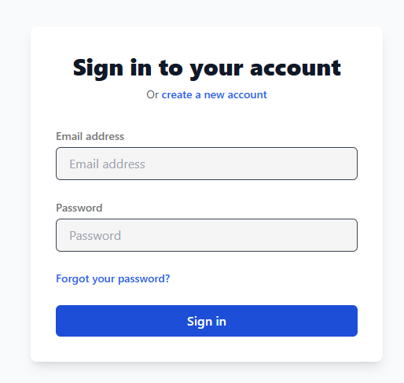

### 2. Profile Tab
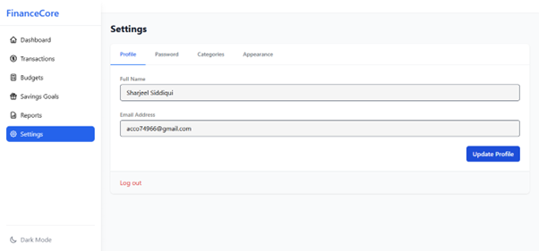

### 3. Categories Tab
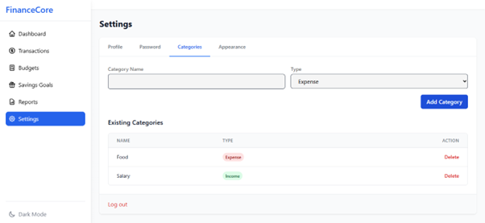

### 4. Transaction Page
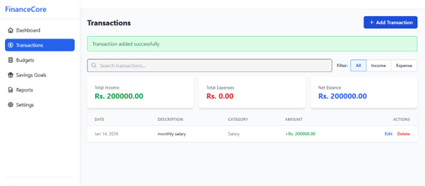

### 5. Add Transactions Page
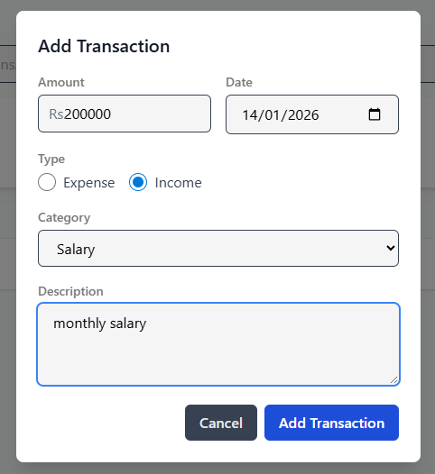

### 6. Add Transaction
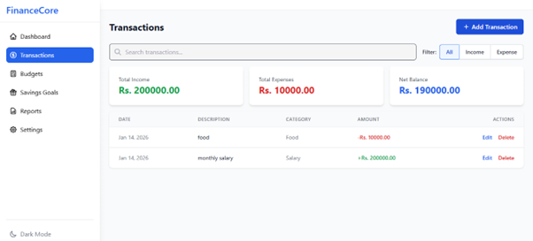

### 7. Budgets Page
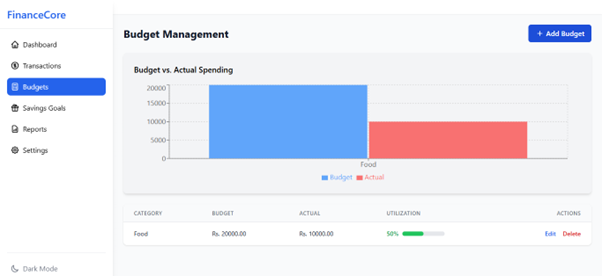

### 8. Add Budget Details
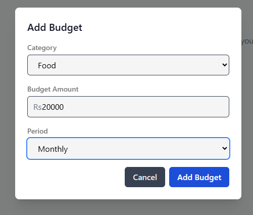

### 9. Savings Goals
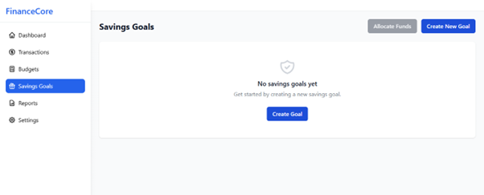 

### 10. Create Goal
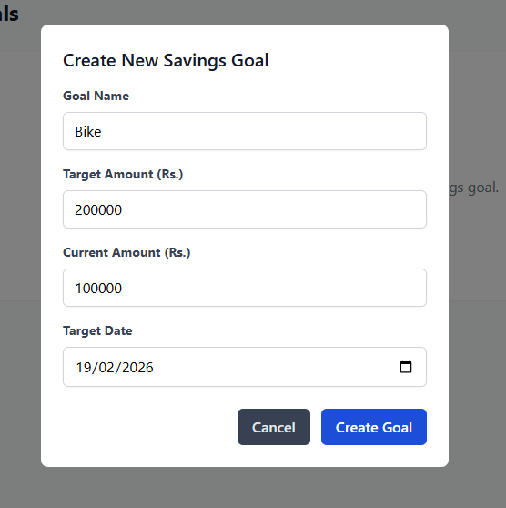

### 11. Saving Goals Detail
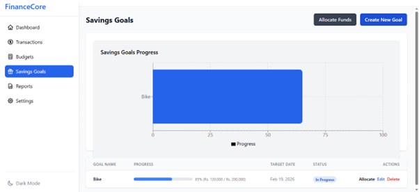

### 12. Reports Page
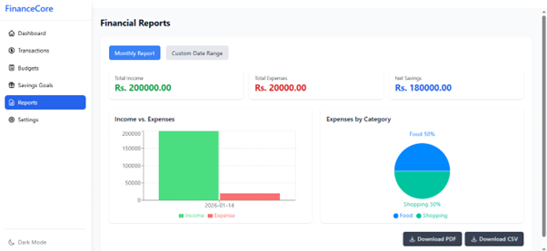

### 13. Admin Panel
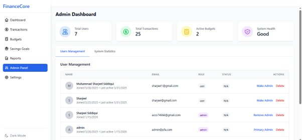

### 14. Dashboard


## 📖 Usage Guide

### Getting Started

1. **Register an Account**
   - Navigate to the registration page
   - Fill in your details (username, email, password)
   - Click "Register" to create your account

2. **Login**
   - Enter your email and password
   - Click "Login" to access your dashboard

### Managing Transactions

1. **Add a Transaction**
   - Go to "Transactions" page
   - Click "Add Transaction"
   - Select category, enter amount, date, and description
   - Choose type (Income/Expense)
   - Click "Save"

2. **Edit a Transaction**
   - Find the transaction in the list
   - Click the "Edit" button
   - Modify the details
   - Click "Save Changes"

3. **Delete a Transaction**
   - Find the transaction in the list
   - Click the "Delete" button
   - Confirm deletion

### Creating Budgets

1. **Set Up a Budget**
   - Navigate to "Budgets" page
   - Click "Create Budget"
   - Select category and period (monthly/yearly)
   - Enter budget amount
   - Set start and end dates
   - Click "Create"

2. **Monitor Budget Progress**
   - View real-time spending vs budget
   - Check progress bars and percentages
   - Receive visual warnings when approaching limits

### Setting Savings Goals

1. **Create a Goal**
   - Go to "Savings Goals" page
   - Click "Add Goal"
   - Enter goal name and target amount
   - Set target date
   - Click "Create"

2. **Update Goal Progress**
   - Add funds to your goal
   - Track progress with visual indicators
   - Mark goals as completed when achieved

### Generating Reports

1. **Monthly Report**
   - Navigate to "Reports" page
   - Select month and year
   - View income, expenses, and net savings

2. **Custom Date Range Report**
   - Select custom date range
   - Generate detailed report
   - Export as PDF or CSV

3. **Export Options**
   - PDF: Professional formatted report
   - CSV: Spreadsheet-compatible format

### Admin Functions

1. **User Management**
   - View all registered users
   - Edit user details
   - Delete user accounts
   - Assign roles

2. **Audit Logs**
   - View system activity
   - Track user actions
   - Monitor security events

## 🔒 Security Features

### Authentication Security
- ✅ JWT-based stateless authentication
- ✅ Secure password hashing with bcrypt (10 salt rounds)
- ✅ Token expiration and refresh mechanism
- ✅ Protected routes with middleware

### Data Security
- ✅ Parameterized queries to prevent SQL injection
- ✅ Input validation and sanitization
- ✅ CORS configuration for secure cross-origin requests
- ✅ Helmet middleware for HTTP security headers

### Authorization
- ✅ Role-based access control (RBAC)
- ✅ Resource ownership verification
- ✅ Admin-only protected routes

### Best Practices
- ✅ Environment variables for sensitive data
- ✅ Secure session management
- ✅ Error messages without sensitive information
- ✅ Regular security audits via audit logs

## 📄 License

This project is licensed under the ISC License. See the [LICENSE](backend/LICENSE) file for details.

## 👥 Contributors

- **Developer**: Sharjeel Siddiqui
- **GitHub**: [@sharjeel-siddiqui12](https://github.com/sharjeel-siddiqui12)

## 🙏 Acknowledgments

- Oracle Database for robust data management
- React community for excellent UI libraries
- Express.js for the powerful backend framework
- All open-source contributors

## 📞 Support

For issues, questions, or contributions:
- Open an issue on [GitHub](https://github.com/sharjeel-siddiqui12/personal-finance-app/issues)
- Contact: [Your Email]

---

**Made with ❤️ for better financial management**